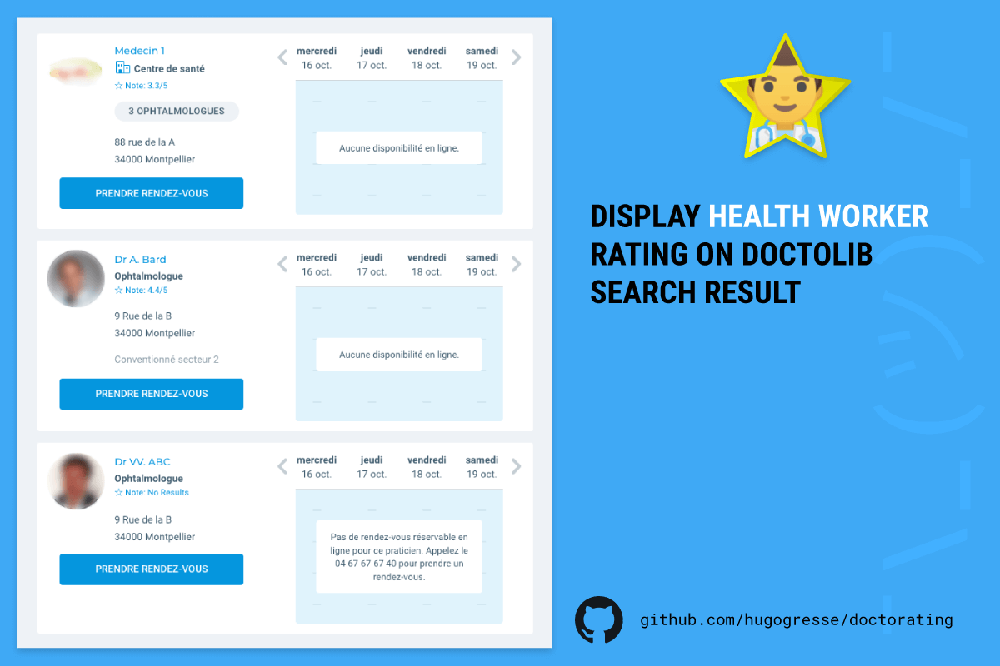

# DoctoRating

A Browser extension (WebExtension) to display Google Maps rating on Doctolib search results.

### Install DoctoRating

- [Chrome](https://chrome.google.com/webstore/detail/doctorating/eajeengjfhpfpopilpkfcodmionfcbkn)
- [Firefox](https://addons.mozilla.org/fr/firefox/addon/doctorating/)

## Contribute

### Install

	npm install

### Development

    npm run dev chrome
    npm run dev firefox
    npm run dev opera
    npm run dev edge

### Build

    npm run build chrome
    npm run build firefox
    npm run build opera
    npm run build edge

### Environment

1. Copy `.env.example` to `.env`
2. Create a new Google Api Key that have access to the Place API, [here](https://console.cloud.google.com/)

### Docs

* [webextension-toolbox](https://github.com/HaNdTriX/webextension-toolbox)
